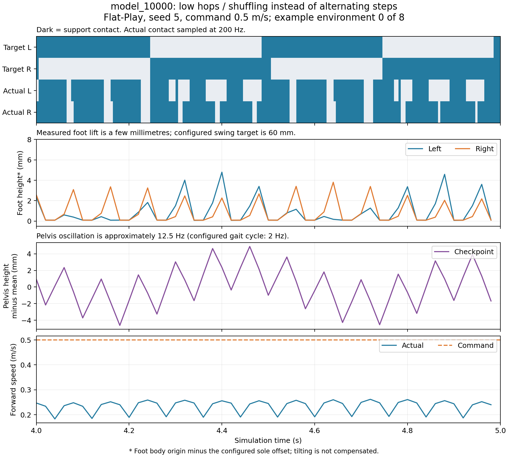

# model_10000.pt 步态诊断

这次训练学到了能存活、能缓慢前进的策略，但没有学会稳定交替迈步。现有奖励允许几毫米的高频弹跳、蹭地获得较高回报；问题涉及奖励条件和奖励之间的冲突，不能只增加抬脚权重。

## 实测

模型：`logs/rsl_rl/tienkung_flat/2026-09-13_11-35-53_flat_baseline/model_10000.pt`。

已核对训练保存的配置：机器人、物理参数、动作、观测和奖励均与当前 Flat 训练配置一致。观测为 261 维，包含步态 sin/cos；不是旧模型缺少相位输入的问题。

使用默认 Flat-Play 配置和确定性策略回放，关闭 LiDAR，seed=5，8 个环境各运行 24 秒，命令为前进 0.5 m/s。保留 Play 的初始化随机化，排除每次重置后前 2 秒，得到 173.26 环境秒的有效样本。Play 和训练的随机化范围并不完全相同，因此以下是回放结果，不能代替训练分布评估。

| 指标 | 结果 |
|---|---:|
| 平均前进速度 | 0.241 m/s，命令为 0.5 m/s |
| 双脚支撑时间占比 | 64.3% |
| 单脚支撑时间占比 | 22.2% |
| 双脚无支撑时间占比 | 13.5% |
| 要求单脚支撑时，实际接触完全符合左右相位 | 22.5% |
| 左 / 右脚高度第 95 百分位 | 4.7 / 3.3 mm，目标为 60 mm |
| 任意一只脚高度超过 30 mm 的样本 | 0 |
| 落脚前无接触时长中位数 / 第 95 百分位 | 25 / 50 ms |
| 无接触时长超过奖励门槛 120 ms 的落脚 | 0 |

支撑占比使用 200 Hz 物理采样、足部合力大于 1 N 的接触定义；瞬间无接触力不等于几何上有明显离地间隙。相位符合率使用 50 Hz 奖励采样。脚高度为脚 body 原点减去配置的脚底偏移，未校正脚倾斜。

8 个环境在第 4–8 秒连续窗口内，骨盆高度的主要频率均为 12.5 Hz；配置的完整左右步态周期则是 0.5 秒，即 2 Hz。单脚支撑比例也不代表有效迈步：这里大量事件是短暂卸载，而非持续摆腿。



## 为什么这样的动作还能得分

1. **接触奖励没有充分区分正确步态和错误动作。** `feet_contact_number` 逐脚打分后取平均。假设当前要求左脚支撑、右脚摆动：

   | 实际状态 | 原始奖励 | 加权后每秒奖励 |
   |---|---:|---:|
   | 左支撑、右摆动 | 1.00 | 0.3500 |
   | 左摆动、右支撑 | -0.30 | -0.1050 |
   | 双脚都接触 | 0.35 | 0.1225 |
   | 双脚都无接触 | 0.35 | 0.1225 |

   正确交替仍然得分更高，但双支撑和无支撑都能持续获得正分。实际回放这一项仍达到 **+0.1723/s**，却几乎没有有效抬脚。接触判定还没有要求支撑或摆动持续足够长的时间。

2. **抬脚目标很难被当前动作触发，而且没有约束对侧支撑。** `feet_clearance` 使用 `exp(-((h-0.06)/0.025)^2)`；脚在地面时原始值只有 0.00315，几毫米的小动作仍接近零。回放实际收益仅 **+0.0010/s**。它只检查目标摆动脚的高度，两脚一起抬到目标高度也能拿到相同抬脚奖励。PPO 无需对奖励求导，这里的问题是探索得到的回报区分度低，不能表述成“没有可微梯度”。

3. **身体高度参考会与单脚抬起冲突。** `base_height` 用根节点高度减去两脚的平均高度。在其余位置固定、原本达到目标时，单脚抬高 6 cm，会让原始高度奖励从 1 降到约 0.698；身体与双脚一起升高则保持不变。它不能独立约束身体相对地面的高度。回放这一项为 **+0.4879/s**，接近满分 0.5/s。

4. **落脚奖励在这个策略上没有发挥作用。** `feet_air_time` 要求无接触超过 0.12 秒，当前短促弹跳完全达不到，回放收益为 **0**。所以不能把这次现象归因于“事件奖励变强，策略靠腾空刷分”。不过它确实没有排除双脚一起落地，直接降低门槛或增加权重可能进一步奖励弹跳。

5. **速度跟踪容差较宽。** 线速度指数奖励使用 `std=0.5`。即使前进速度只有命令的一半左右，回放仍拿到 **+1.1388/s**，约为该项上限的 76%。其他高额收益不要求机器人真正迈步，使这种动作成为可行的局部解。

训练日志也符合上述现象。最近 501 个记录点（9500–10000）平均回报 **49.92**，跑满时限的回合比例 **94.3%**；平均每回合抬脚奖励只有 **0.0233**，落脚奖励 **0.00122**。此前 4500–4999 的平均回报是 41.94。总分持续上涨，步态目标却没有同步实现。

## 建议修改顺序

1. 明确 Flat 的目标为步行：奖励符合相位的完整左右接触组合，双脚无支撑不给正分；保留合理的短双支撑过渡，并惩罚持续无支撑。使用短时接触滤波或持续时间判断，避免把接触冲量抖动当成迈步。
2. 抬脚和落脚奖励要求对侧保持有效支撑，并排除同时起跳、同时落脚。抬脚目标随摆动相位平滑变化，可先用较低目标建立交替，再逐渐达到 6 cm。
3. 身体高度改为参考实际地面；Flat 可直接使用平面高度，Rough 应使用地形采样，避免摆动脚改变身体高度基准。
4. 修正条件后再平衡权重和速度容差；记录有效摆动时长、抬脚高度、左右交替率和持续腾空比例，用这些指标与回报共同选择 checkpoint。先短训回放确认出现真实迈步，再投入长训。

这些修改需要重新训练或微调才会改变策略，仅修改 Play 的奖励不会改变 checkpoint 的动作。本次只做诊断，没有修改生产奖励或启动训练。

补充边界：固定默认关节目标的对照没有稳定站住，最长回合不足 2 秒，无法形成稳态对比；因此不能用该对照排除 PD 参数或接触动力学对高频振动的影响。当前证据直接证明的是奖励对错误步态的容许，以及策略实际未达到交替摆腿目标；各项修改的因果效果仍需训练对照验证。

数据与复现：`diagnose_gait.py`、`rollout_summary.json`、`rollout.npz`、`physics_contacts.npz`、`training_windows.json`；图由 `plot_gait.py` 生成。固定站姿对照保存在 `default_pose_reference/`。

```bash
.venv/bin/python reports/flat_baseline_20260914/diagnose_gait.py \
  --checkpoint logs/rsl_rl/tienkung_flat/2026-09-13_11-35-53_flat_baseline/model_10000.pt
.venv/bin/python reports/flat_baseline_20260914/plot_gait.py
```
