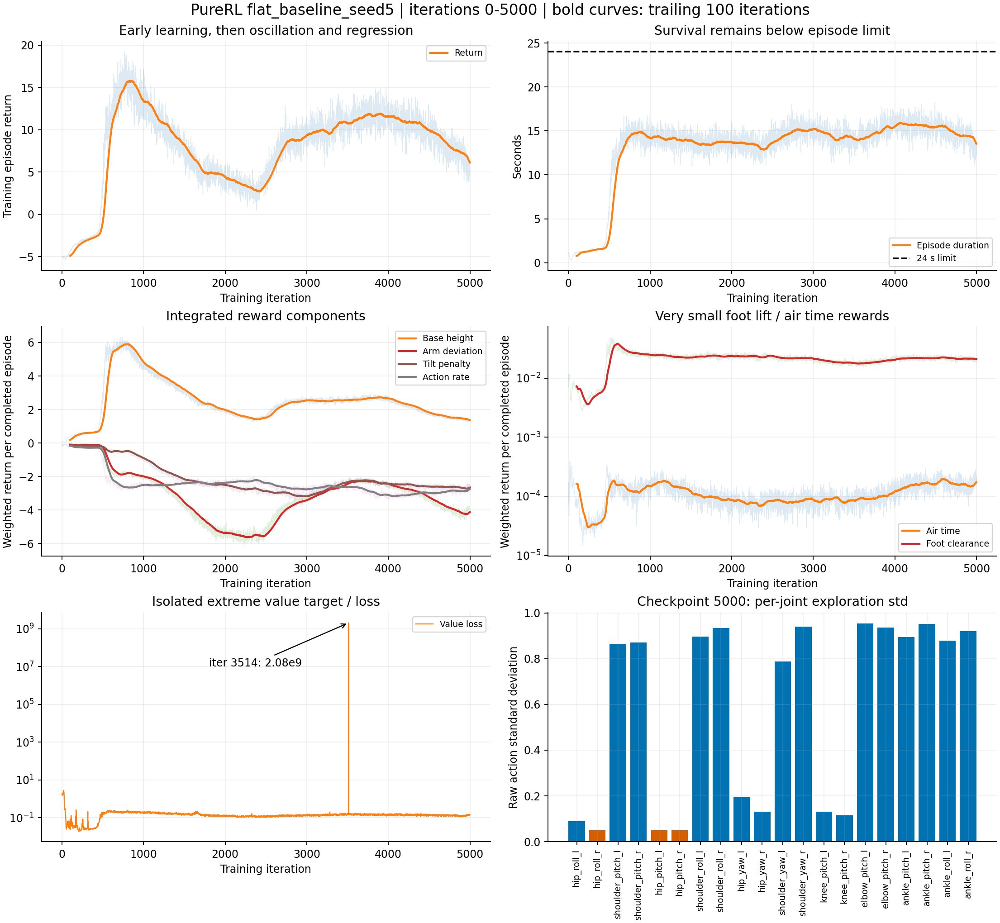

**2026-09-12_23-29-34_flat_baseline_seed5 训练诊断**

这次训练存在早期学习，随后长期振荡、部分退化。优先级最高的原因是动作张量共享导致 PPO 终止样本被改写；其次是 Flat 缺少环境间碰撞隔离。奖励读取、步态可观测性及探索分配也有明确问题。当前证据不支持仅靠延长训练或提高学习率解决。

分析日期：2026-09-13。固定统计范围为 iteration 0–5000，最后一个事件时间为本机时间 2026-09-13 11:01:19。读取了实际运行保存的 env.yaml、agent.yaml、TensorBoard 全量标量、本地 W&B output.log、model_0/1000/2000/3000/4000/5000.pt，以及仓库和本机安装的 RSL-RL / Isaac Sim 源码。分析时训练仍在运行；没有修改训练源码、默认 YAML 或操作训练进程。

仓库 HEAD：`a2a98f7fbad30994152cd7c77133bc2704e5d6ae`。run 保存的 git diff 为 clean；实际配置与当前 Flat preset 的差异只有 run_name 和解析后的 URDF 绝对路径。

**1. 曲线证明的是“早期学到、后续不稳”**

| 迭代区间（含两端） | Train 平均回报 | Train 平均 episode 时长 | 失败终止比例估计 |
|---|---:|---:|---:|
| 500–999 | 13.47 | 13.61 s | 76.1% |
| 2000–2999 | 5.69 | 14.13 s | 72.1% |
| 4000–4499 | 10.76 | 15.63 s | 64.8% |
| 4500–5000 | 7.82 | 14.58 s | 68.8% |
| 4901–5000 | 6.13 | 13.54 s | 72.8% |

最佳连续 100 次迭代回报均值为 15.77，窗口结束于 iteration 832。此后没有建立更好的稳定平台。episode 上限为 24 s / 1200 步，当前生存时长距上限仍有明显差距。

失败比例由 `-Episode/termination_penalty / 4` 推算，因为失败单次惩罚实际是 `-200 × 0.02 = -4`，超时本身不触发该奖励。它是各 iteration 内“已结束 episode 的失败占比”的窗口平均，并非逐步跌倒率，也不是严格按整个窗口 episode 数量加权的比率；失败原因可为 pelvis 接触或倾斜超过 0.8 rad，日志未分开统计。

`Episode/*` 是带权、乘 dt 后的完整 episode 累积奖励，并非单位时间奖励；跨阶段同时受 episode 长度影响。`Train/*` 使用 RSL-RL 最近 100 个结束 episode 的 deque，与当次 rollout 的 `Episode/*` 统计样本不同，因此二者无需逐项精确相等。

**2. P0：环境 reset 改写 PPO 动作，已完成独立复现**

调用链：

1. RSL-RL `PPO.act()` 生成动作，保存 `transition.actions` 和该动作的旧 log-prob，返回同一个动作张量。`.detach()` 不复制底层存储。
2. 当前 `actions.clip: null`、`clip_actions: null`，`JointPositionActionManager.process()` 直接令 `self.action = action`。
3. `BaseVecEnv.step()` 对结束环境自动 reset，`action_manager.reset()` 执行 `self.action[env_ids] = 0`。
4. 此时 PPO 尚未调用 `process_env_step()` 将 transition 复制进 storage。因此失败或超时那一步，buffer 中的动作变为零，旧 log-prob 仍属于实际执行的动作。

位置：[actions.py:30](/home/sia_luo/Project/PureRL/source/purerl/purerl/mdp/actions.py:30)、[base.py:95](/home/sia_luo/Project/PureRL/source/purerl/purerl/envs/base.py:95)、[ppo.py:143](/home/sia_luo/Project/PureRL/.venv/lib/python3.11/site-packages/rsl_rl/algorithms/ppo.py:143)。

CPU 复现使用本机实际 RSL-RL PPO/storage 和仓库 action manager，关闭 observation normalization，不执行任何优化器更新：

| 条件 | 终止环境：存储动作与执行动作最大差值 | 终止环境 PPO ratio | 其余环境 ratio |
|---|---:|---:|---|
| 当前共享动作方式 | 2.33874 | 290546.06 | 1, 1, 1 |
| 仅在交给 manager 前 clone 的对照 | 0 | 1 | 1, 1, 1 |

相同策略对相同动作重新计算 log-prob，本应得到 ratio=1。这里完全不依赖物理仿真即可证明数据被破坏。初始几轮 surrogate loss 为 10038555、7718523、582061、3207817，与严重的概率比异常相符；这些日志数值还可能叠加早期 observation normalization 的变化，不能全部归因到单一因素。

更关键的是，这个问题集中发生在终止样本。算法需要从失败前的实际动作学习，却拿到了被清零的动作，可能将失败信用错误分配给零动作。随着某些关节 std 降低，零动作又可能落在原分布极低密度的位置，使这些关键样本的更新进一步失真。

修复方向：环境内部拥有独立动作存储，`process()` 复制传入动作，`reset()` 只修改内部状态；同时验证 `previous_action` 的生命周期。不要通过恢复任意动作裁剪来掩盖共享存储问题。验证必须覆盖 terminated 和 truncated，并检查 buffer 动作与实际执行动作相等。

**3. P0：Flat 4096 个机器人没有环境间碰撞过滤**

[isaac_backend.py:185](/home/sia_luo/Project/PureRL/source/purerl/purerl/sim/isaac_backend.py:185) 中，`cloner.clone(..., enable_env_ids=False)` 对两种地形都生效；`filter_collisions()` 则只在 `terrain_assignment is not None` 的 Rough 分支调用。Flat 的 `collision_filtering_mode` 保持 `spatial_separation`。`self_collisions: false` 控制单个机器人的自碰撞，不能代替 clone 之间的隔离。

Flat 的间距为 2.5 m，初始位置还随机 ±0.5 m，episode 长 24 s，前进命令最高 0.6 m/s。仅连续以 0.3 m/s 行走 8 s 就可移动 2.4 m；相邻机器人独立随机朝向和移动，仅靠出生点间距不能保持环境独立。NVIDIA 文档明确说明，`enable_env_ids` 或 `filter_collisions` 用于 clone 间碰撞过滤。[Isaac Sim 5.1 Cloner 文档](https://docs.isaacsim.omniverse.nvidia.com/5.1.0/py/source/extensions/isaacsim.core.cloner/docs/index.html)

**代码中缺少隔离是确定事实；实际碰撞频率及其对本次回报的贡献尚未测量。** 它能解释一种可能的现象：机器人刚学会移动后，开始受到邻居及邻居 reset 的干扰，环境难度随整体策略变化，但观测中又没有邻居信息。

iteration 3514 出现单次极端异常：

- `Loss/value_function = 2.082192e9`，前后约 0.15–0.16。
- `Episode/ang_vel_xy_l2 = -38400.246`，前后约 -1.8 至 -1.9。

这说明至少发生过极端状态/奖励样本。跨环境碰撞、重叠 reset 或其他物理数值异常均需验证，不能仅凭标量断定是哪一种。该异常仅持续一轮，也不能解释此前几千轮的长期问题。3000–3999 区间 value loss 的算术均值被这一点严重放大，分析时应同时看 median 和异常位置。

修复方向：Flat 同样过滤 env_paths 间碰撞，保留与真实 ground-plane prim 的碰撞；用实际接触/重叠场景验证，不只检查字符串标志。增大 env_spacing 只能作为临时诊断对照。

**4. P1：力矩惩罚读取了错误语义的 API**

`Episode/dof_torques_l2` 在 0–5000 全部标量中精确为零。[isaac_backend.py:406](/home/sia_luo/Project/PureRL/source/purerl/purerl/sim/isaac_backend.py:406) 读取 `get_applied_joint_efforts()`，但控制走的是 position target + PhysX PD drive。

该 API 返回通过 `set_joint_efforts()` 显式写入的 effort，本机安装的 Isaac Sim 源码 docstring 和官方文档均如此定义。因此这里的零值不代表电机没有出力，而是当前惩罚没有读取 drive 的实际输出。[Isaac Sim 5.1 Joint Sensors 文档](https://docs.isaacsim.omniverse.nvidia.com/5.1.0/sensors/isaacsim_sensors_physics_articulation_force.html)

修复方向：明确奖励需要约束的执行器量，验证可用的 drive-force 数据或与实际驱动一致的 PD 力矩估计。`get_measured_joint_efforts()` 是关节力在运动轴上的投影，语义也需核对，不能未经验证就当作完全等价的电机输出。先确认数值，再调整 `-1e-6` 权重。当前仅覆盖腿部关节，手臂不在此项中。

**5. P1：时钟步态奖励缺少观测，腾空奖励量级很小**

[tienkung_locomotion.py:257](/home/sia_luo/Project/PureRL/source/purerl/purerl/envs/tienkung_locomotion.py:257) 用 `episode_length_buf × 0.02 / 0.5` 生成步态相位，左右脚要求每半周期交替。`feet_contact_number` 和 `feet_clearance` 依赖这个相位。

但 [policy observation 装配](/home/sia_luo/Project/PureRL/source/purerl/purerl/envs/tienkung_locomotion.py:187) 的 259 维没有 phase、sin/cos phase 或 episode time，actor/critic 都是无记忆 MLP，且共用同一组 noisy observation。相同物理观测在不同隐藏时钟相位可能对应不同奖励；CPU 对照中，同样的左脚接触和速度指令，仅改变期望支撑相，`feet_contact_number` 就从 1 变成 -0.3。

这造成部分可观测性与奖励冲突，但不意味着 MLP 在任何情况下都绝对学不会：动作、姿态可能间接编码相位。实际问题是相位没有被明确、可靠地提供。启动时默认还随机 episode_length_buf，初始物理状态与时钟相位不保证一致。

建议先把 `feet_contact_number` 和 `feet_clearance` 设为 0 做基础速度任务对照；保留时钟步态设计时，应给 actor/critic 一致的 sin/cos 相位，并同步修改 observation contract、配置和导出。维度变化后不要直接把旧 259 维模型当作同架构续训。

此外，[feet_air_time_on_contact()](/home/sia_luo/Project/PureRL/source/purerl/purerl/mdp/rewards.py:67) 只在落脚事件支付：

`sum(clip(last_air_time - 0.12, 0, 0.12) × contact_event)`。

[RewardManager](/home/sia_luo/Project/PureRL/source/purerl/purerl/mdp/managers.py:115) 仍对该离散事件乘 `dt=0.02`，因此单脚一次落地的最大奖励只有 `0.12 × 0.75 × 0.02 = 0.0018`。按 0.5 s 的完整左右周期、每周期两次落脚计算，最多约 0.0072 reward/s，而两项速度跟踪合计上限为 2.25 reward/s。当前设计需要重新标定事件奖励与持续奖励的尺度，不能只从 YAML 的 0.75 以为它很强。

4500–5000 平均每 episode：air_time 约 0.000169，feet_clearance 约 0.0215。它们与“没有形成有效抬脚”的行为相符，但单凭日志不能认定是拖步，也不能排除接触事件计算问题；需记录落脚次数、有效腾空时长、脚高及视频。

**6. PPO 配置与探索：次于上述 bug，但确有改进空间**

实际 [agent.yaml](/home/sia_luo/Project/PureRL/logs/rsl_rl/tienkung_flat/2026-09-12_23-29-34_flat_baseline_seed5/params/agent.yaml) 为：

| 配置 | 当前值 | 诊断 |
|---|---|---|
| 环境 / rollout | 4096 × 60 | 每轮 245760 transitions；mini-batch 61440，2 epochs × 4 batches = 8 次更新 |
| 控制周期 / episode | 0.02 s / 24 s | rollout 覆盖 1.2 s；完整 episode 1200 步 |
| learning_rate / schedule | 1e-5 / adaptive | 1e-5 是初值，实际并非一直不变 |
| desired_kl | 0.01 | 本机 RSL-RL 的 adaptive LR 上下限为 1e-5 和 1e-2 |
| gamma / lambda | 0.994 / 0.9 | GAE 衰减因子 0.8946，直接 TD 残差权重的时间尺度约 0.19 s；价值 bootstrap 仍可传递更长时程信息 |
| init std / std bounds | 1.0 / [0.05, 3.0] | 均值指标掩盖很不均匀的关节探索 |
| action scale / clip | 0.25 / null | position target = default + 0.25 × action；动作均值本身无幅值约束 |
| actor / critic | [512,256,128] / [768,256,128] | 没有证据显示网络容量是主要瓶颈 |

初期实际学习率一度约 8.65e-4；4500–5000 平均约 2.70e-5。因此“初始学习率太小导致一直不学”不符合日志；而且只改初始值仍会受 adaptive 调度影响。终止动作错配不一定反映在基于分布参数计算的 KL 中，不能依赖 adaptive KL 修复该 bug。

model_5000 的平均 std 约 0.582，但右 hip_roll、左右 hip_pitch 已到 0.05 下限；手臂多为 0.79–0.95，脚踝约 0.88–0.95。乘 action scale 后，部分髋关节噪声仅 0.0125 rad，而手臂和脚踝仍约 0.20–0.24 rad。全局 mean_noise_std 看起来平稳，并不说明有效探索分配合理。所有已检查 checkpoint 的模型张量有限，没有全模型 NaN 或全局 std 爆炸的证据。

初始统一 std=1 配合 hip/knee Kp=700 和 scale=0.25，对这些关节形成 0.25 rad 的目标扰动，静态 Kp×误差量级约 175 N·m，实际输出还取决于阻尼、限幅和隐式求解器。这可能使初期平衡探索很激烈，但 Kp 数值本身不足以判定配置错误。

回报分解也显示策略姿态在退化：500–999 对比 4500–5000，base_height 从 +5.38 降至 +1.53，arm deviation 从 -1.77 变成 -3.90，orientation 从 -0.61 变成 -2.63；同时线速度跟踪从 +14.85 到 +16.43、角速度跟踪从 +4.95 到 +7.52。它在一些任务项上进步，却损失了姿态质量。由于两窗口时长相近且后者略长，不能把上述姿态退化解释为单纯 episode 变短。

**7. 其他环境配置：适合在修复后降低起步难度**

Flat 虽然关闭了外力、周期 push 和 gain randomization，但仍始终执行质量、质心和摩擦随机化：pelvis ±5 kg、COM x/y ±3 cm / z ±2 cm、摩擦系数采样 0.1–2.0（dynamic 会限制不超过 static）。URDF pelvis 质量约 27.77 kg，总质量约 61.76 kg，因此 ±5 kg 约为 pelvis 的 ±18%，并非出现负质量的配置。

命令从开始就含前后、侧向与全范围 heading 目标，20% standing，8 s 重采样。Flat 没有 curriculum。对尚未建立稳定站走的策略，这些因素增加学习难度，但目前没有消融证据将其列为首要根因。

187 个 height-scan 值占 259 维的大部分；平地上主要重复反映基座高度并叠加噪声，是可以简化的输入，但不是本次优先修复项。`default_root_height=0.89` 与仓库的机器人几何记录一致，没有证据应先改站高目标。

**8. 推荐的处理顺序与可比较实验**

先修数据与环境正确性，再改变优化参数。以下是待验证方案，尚未运行新训练：

1. **修复基线**：复制内部动作，补齐 Flat 跨环境碰撞过滤；验证这两项后，用相同 seed 和其余相同配置从头训练，观察能否消除初期巨大 surrogate loss，并改善终止比例。旧 checkpoint 可保留作评估对照，不适合作为干净修复实验的起点。
2. **修正奖励数据**：补齐可验证的 torque 数据；暂时去掉两项时钟奖励，检查站立/速度跟踪。逐项恢复奖励，或在明确加入 phase 观测后开启时钟步态。
3. **简化课程**：固定摩擦为 1，质量增量/COM 偏移为 0；先测 x=[0,0.3]、y=0、yaw=0，heading_command=false，保留部分 standing。稳定后分阶段恢复原随机化和多方向命令。
4. **再做 PPO 单因素对照**：可试 init_noise_std=0.3–0.5、lambda=0.95、epochs=4；分别验证，避免一次全改。现有实现仍是统一初始 std，若要分组设置需明确扩展代码。学习率保留 adaptive 时记录实际值和 KL，不能只对比 YAML 初始数值。不要直接放宽 std 下限/上限来处理当前不均匀探索。
5. **评估 checkpoint 1000/3000/4000/5000**：采用无探索动作，在固定命令、环境隔离的 Flat 场景比较生存时间、速度 RMSE、脚滑、脚高和姿态；训练回报不足以选出最终模型。原 checkpoint 1000 位于早期高回报阶段，值得作为对照，但尚无确定性 rollout 证明它实际最好。

建议新增可诊断指标：分终止原因与 timeout 比例、每关节 std/动作均值/饱和率、PPO KL/clip fraction/ratio 分位数（终止样本单列）、解释方差、按秒或按步归一化的奖励、command 分桶速度误差、落脚次数/air time/脚高、非脚接触、异常状态最大值。遇到极端样本应保存 env id 和前后状态，避免像 iteration 3514 一样只留下聚合标量。

**9. 证据文件与复现范围**

- [summary.json](summary.json)：固定窗口均值/中位数、极值、checkpoint std 和动作错配复现结果。
- [scalars.csv](scalars.csv)：iteration 0–5000 的原始标量导出。
- [training_diagnostics.png](training_diagnostics.png) / [PDF](training_diagnostics.pdf)：独立可分享的曲线图。
- [analyze.py](analyze.py)：CPU 日志分析及最小复现脚本。仓库根目录执行 `.venv/bin/python reports/flat_baseline_seed5_20260913/analyze.py`，仅重写此报告目录内的派生证据。

本次没有启动额外 Isaac Sim rollout 或消融训练。动作错配及 clone 对照已实测；碰撞过滤缺失、相位缺失、torque API 语义与奖励尺度由源码确定；各项对最终收敛的独立贡献、实际行走形态及 iteration 3514 的具体物理原因仍需上述实验量化。
